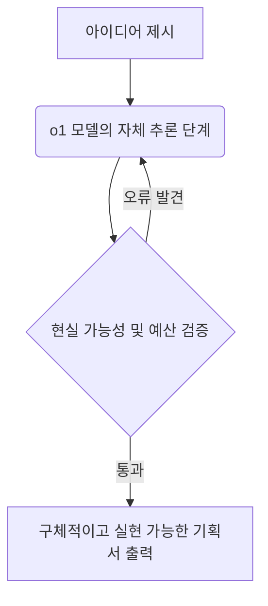

# ChatGPT o1 사용법 완벽 분석 및 총정리


# ChatGPT o1 사용법 완벽 가이드: 직접 써보고 깨달은 실전 활용 꿀팁과 솔직한 한계점

며칠 전, 평소처럼 밀린 업무를 처리하다가 문득 머리가 지끈거렸습니다. 복잡한 데이터 통계 자료를 분석하고 이를 기반으로 새로운 마케팅 기획서를 작성해야 했거든요. 기존의 인공지능 도구들에게 질문을 던져봤지만, 돌아오는 대답은 늘 겉핥기식의 뻔한 이야기뿐이었습니다. "아, 역시 아직은 인간의 깊은 사고를 따라오기 힘들구나" 하고 한숨을 쉬던 찰나, 최근 화제가 되고 있는 새로운 모델을 떠올렸습니다. 

바로 오픈에이아이(OpenAI)가 야심 차게 내놓은 생각하는 인공지능, o1 모델이었습니다. 소문만 무성하던 이 녀석을 직접 업무에 도입해 본 순간, 솔직히 온몸에 소름이 돋았습니다. 기존 모델들이 질문을 던지자마자 0.1초 만에 그럴싸한 대답을 '뱉어내는' 느낌이었다면, 이 모델은 마치 유능한 수석 연구원이 턱을 괴고 진지하게 고민한 뒤에 묵직한 해답을 내놓는 듯한 기분이 들었기 때문입니다.

오늘 포스팅에서는 제가 직접 밤을 새워 가며 삽질하고 테스트하면서 터득한 **ChatGPT o1 사용법**을 아주 기초적인 설정 단계부터 실무에 바로 써먹을 수 있는 고급 활용 기술까지 아낌없이 전부 풀어보려 합니다. 이 글을 끝까지 읽으시면 단순히 질문 몇 번 던져보는 수준을 넘어, 여러분의 업무 효율을 최소 10배 이상 끌어올릴 수 있는 진짜 **ChatGPT o1 사용법**을 완벽하게 마스터하시게 될 겁니다.

---

## ChatGPT o1 사용법, 도대체 기존 모델과 무엇이 다를까?

새로운 도구를 제대로 쓰려면 그 도구가 어떤 원리로 작동하는지 머릿속으로 그려볼 수 있어야 합니다. 그래야 엉뚱한 질문을 던져 돈과 시간을 낭비하는 일을 막을 수 있으니까요. 우리가 기존에 자주 쓰던 GPT-4o와 이번에 새롭게 등장한 o1의 가장 결정적인 차이는 바로 **'생각의 사슬(Chain of Thought)'**이라는 개념에 있습니다.

> **쉽게 이해하는 비유**
> * **기존 GPT-4o**: 퀴즈 쇼에 나와서 사회자의 말이 끝나기가 무섭게 버저를 누르고 직관적으로 떠오르는 답을 빠르게 말하는 참가자.
> * **새로운 ChatGPT o1**: 어려운 논술 시험 문제를 앞에 두고, 연습장에 문제를 쪼개어 분석하고, 자신이 세운 가설이 맞는지 스스로 검증해 가며 신중하게 답안지를 작성하는 수석 장학생.

기존 모델은 우리가 질문을 던지면 문맥상 다음에 올 확률이 가장 높은 단어들을 실시간으로 조합해 답변을 생성했습니다. 그러다 보니 복잡한 수학 문제나 고도의 논리적 추론이 필요한 코딩 디버깅 작업에서는 겉보기엔 그럴듯하지만 속은 텅 빈, 이른바 '환각 현상(Hallucination)'을 자주 일으키곤 했습니다.

반면 o1은 답변을 출력하기 전에 스스로 내부적인 '추론 토큰'을 사용합니다. "이 문제를 해결하려면 먼저 A를 정의해야겠군", "어? 그런데 이렇게 하면 B 단계에서 오류가 나지 않을까?", "그렇다면 C라는 대안을 적용해 보자"라는 식으로 스스로 생각하는 과정을 거치는 것이죠. 이러한 특성을 명확히 이해하는 것이 제대로 된 **ChatGPT o1 사용법**의 핵심 출발점입니다.

---

## 초보자도 바로 따라 하는 ChatGPT o1 사용법 단계별 가이드

아무리 좋은 기술도 쓸 줄 모르면 그림의 떡이겠죠? 지금부터 아주 직관적이고 쉽게 사용할 수 있는 구체적인 단계를 설명해 드리겠습니다.

### 1단계: 준비물 및 계정 확인하기
가장 먼저 알아야 할 **ChatGPT o1 사용법**은 현재 이 모델이 유료 서비스인 '플러스(Plus)', '팀(Team)', 혹은 '기업용(Enterprise)' 계정 사용자에게 우선적으로 제공된다는 점입니다. 아쉽게도 현재 무료 버전에서는 사용이 제한적이거나 접근이 불가능할 수 있으니, 본격적인 활용을 원하신다면 월 구독 서비스를 이용하시는 것을 권장합니다.

### 2단계: 모델 선택 창 활성화하기
인터넷 브라우저를 열고 서비스 페이지에 접속하여 로그인합니다. 화면 왼쪽 상단 혹은 중앙에 있는 모델 선택 드롭다운 메뉴를 클릭해 보세요.

```text
[모델 선택 메뉴 예시]
┌─────────────────────────────────┐
│  GPT-4o (일상적인 대화, 빠른 답변)  │
├─────────────────────────────────┤
│  o1-preview (복잡한 추론 및 기획)   │  ◀ 선택!
├─────────────────────────────────┤
│  o1-mini (빠르고 가벼운 코딩/이공계)│  ◀ 선택!
└─────────────────────────────────┘
```

여기서 우리는 목적에 따라 두 가지 중 하나를 선택해야 합니다.
* **o1-preview**: 깊이 있는 논리 분석, 종합적인 기획서 작성, 복잡한 텍스트 분석에 적합합니다.
* **o1-mini**: 속도가 비교적 빠르며 수학 문제 풀이, 과학적 추론, 그리고 특히 개발 코드 작성 및 디버깅에 엄청난 성능을 발휘합니다.

모델 선택 창에서 자신의 목적에 맞는 모델을 정확히 지정하는 것이 올바른 **ChatGPT o1 사용법**의 첫 단추입니다.

---

## 실무 효율을 10배 올리는 ChatGPT o1 사용법 실전 시나리오

제가 실제 업무를 진행하면서 엄청난 희열을 느꼈던 4가지 구체적인 실무 적용 사례를 소개해 드리겠습니다. 단순히 이론적인 이야기가 아니라, 실제로 겪은 경험담이니 눈여겨보시면 큰 도움이 될 것입니다.

### 1. 복잡한 코딩 문제 해결을 위한 ChatGPT o1 사용법

개인 프로젝트로 웹 서비스를 개발하다 보면 꼭 원인 모를 오류에 부딪혀 몇 시간씩 모니터만 노려보게 되는 순간이 있습니다. 예전에는 에러 메시지를 복사해서 질문하면 단편적인 코드 조각만 던져주어 이를 다시 짜 맞추느라 고생했는데요. o1을 사용한 뒤로는 개발 과정이 완전히 달라졌습니다.

> **실제 적용 경험담**
> 데이터베이스 연결 과정에서 계속해서 비동기 처리 오류가 발생해 반나절 동안 헤맨 적이 있습니다. 이때 o1-mini 모델을 선택하고 제 전체 소스 코드와 에러 로그를 통째로 붙여넣었습니다.
> 
> 이 녀석은 답변을 바로 내놓지 않고 약 15초 동안 '생각 중(Thinking)'이라는 상태 표시를 띄우더니, 제가 작성한 비동기 함수의 실행 순서가 꼬인 지점을 정확히 짚어냈습니다. 단순히 코드만 고쳐준 것이 아니라, 왜 이런 문제가 발생했는지 인과관계를 일목요연하게 설명해 주더라고요. 덕분에 에러 해결은 물론 공부까지 동시에 할 수 있었습니다.

### 2. 논리적 기획서 작성을 위한 ChatGPT o1 사용법

새로운 비즈니스 모델을 구상하거나 마케팅 전략을 세울 때, 기존 모델들은 "타겟 고객을 분석하고 SNS 마케팅을 하세요" 같은 뻔한 소리만 늘어놓기 일쑤였습니다. 하지만 o1-preview 모델은 다릅니다.

* **질문 예시**: "친환경 텀블러 브랜드를 런칭하려고 해. 자본금은 1,000만 원이고 초기 마케팅 예산은 200만 원이야. 20대 대학생을 타겟으로 한 3개월짜리 구체적인 게릴라 마케팅 전략과 예산 집행 계획을 표 형태로 짜줘."
* **작동 방식**: 질문을 받은 o1은 대학생들의 생활 패턴, 학기 중과 방학 기간의 차이, 200만 원이라는 한정된 예산의 한계점을 스스로 계산합니다. 
* **결과물**: 단순한 나열이 아닌, 1주 차부터 12주 차까지 대학가 주변 카페와의 협업 방안, 대학생 서포터즈 운영 시 지급할 리워드의 구체적인 단가까지 계산된 극도로 정교한 기획서를 뽑아내 줍니다. 이처럼 기획 단계에서 **ChatGPT o1 사용법**을 잘 적용하면 기획서 초안 작성 시간을 며칠에서 단 몇 시간으로 단축할 수 있습니다.



### 3. 방대한 전문 자료 및 논문 분석

연구원이나 대학원생, 혹은 트렌드 분석가들에게 이 도구는 축복과도 같습니다. 수십 페이지에 달하는 영문 보고서나 기술 표준 문서를 해석해야 할 때, 기존에는 텍스트를 나누어 입력해야 하거나 전체적인 맥락을 놓치는 경우가 많았습니다.

o1 모델에 전문 자료의 텍스트를 입력하고 분석을 요청하면, 문서 내부의 논리적 모순점이나 핵심 주장 사이의 상관관계를 놀라울 정도로 날카롭게 분석해 냅니다. 단순히 "요약해 줘"가 아니라, "이 논문이 주장하는 바의 맹점은 무엇이며, 이를 보완하기 위해 추가로 검증해야 할 가설 3가지를 제시해 줘" 같은 고차원적인 질문을 던졌을 때 진가를 발휘합니다.

---

## 기존과 완전히 달라진 ChatGPT o1 사용법 프롬프트 작성법

많은 분이 기존 GPT-4o나 클로드(Claude)를 쓸 때 사용하던 버릇 그대로 o1에 질문을 던지곤 합니다. 하지만 이는 슈퍼카를 사놓고 시속 30km로 동네 마트만 다녀오는 것과 다름없습니다. o1의 잠재력을 극한으로 끌어올리기 위해서는 명령어(프롬프트) 작성 방식을 완전히 바꾸어야 합니다.

### ❌ 잘못된 프롬프트 예시 (기존 방식)
> "단계별로 차근차근 생각해서 대답해 줘. 네가 마케팅 전문가라고 가정하고, 친환경 텀블러 마케팅 계획을 작성해 줘."

기존에는 인공지능의 환각을 줄이기 위해 "단계별로 생각해라(Think step-by-step)", "역할을 부여한다(Act as a...)" 같은 제약 조건을 억지로 쑤셔 넣어야 했습니다. 하지만 o1에게 이런 지시를 내리는 것은 불필요한 잔소리에 불과합니다. 모델 자체에 이미 고도의 추론 프로세스가 내장되어 있기 때문입니다. 오히려 이러한 수식어들이 모델의 자유로운 사고를 방해할 수 있습니다.

###  올바른 프롬프트 예시 (o1 전용 방식)
> "목표: 20대 대학생 대상 친환경 텀블러 브랜드의 3개월 마케팅 전략 수립.
> 제약 조건: 총예산 200만 원, 오프라인 위주의 게릴라 활동 중심.
> 요구사항: 주차별 구체적인 실행 방안과 예상 지출 비용을 상세히 기술할 것."

보시는 것처럼 **단순하고, 명확하며, 목적 지향적**으로 작성하는 것이 핵심입니다. 구태여 어떻게 생각하라고 지시할 필요 없이, 무엇을 원하는지(목표), 어떤 한계가 있는지(제약 조건), 어떤 형태로 출력하길 원하는지(요구사항)만 깔끔하게 정리해 주면 됩니다. 이 원칙을 지키는 것이 가장 완벽한 **ChatGPT o1 사용법**의 노하우입니다.

---

## 솔직히 말씀드리는 ChatGPT o1 사용법의 한계와 주의점

아무리 뛰어난 기술이라도 단점은 존재하기 마련입니다. 제가 직접 사용하면서 느꼈던 뼈아픈 한계점들과 이를 극복하기 위한 솔루션들을 솔직하게 공유해 드리겠습니다.

### 첫째, 생각하는 시간(대기 시간)이 다소 깁니다
질문을 던지면 즉시 답변이 나오지 않고, 짧게는 5초에서 길게는 1분 이상 '생각 중...'이라는 메시지가 뜹니다. 따라서 단순한 단어 뜻 찾기, 이메일 답장 초안 작성, 간단한 맞춤법 검사 등 **빠른 피드백이 필요한 일상적인 작업에는 오히려 비효율적**입니다. 

* **해결책**: 가벼운 일상 업무나 단순 텍스트 작업은 **GPT-4o**를 사용하시고, 고도의 논리적 사고나 기획이 필요한 작업에만 **o1**을 선택하여 사용하는 이원화 전략을 취하세요.

### 둘째, 사용 횟수 제한이 엄격합니다
현재 유료 구독자라 할지라도 o1 모델은 주당 또는 하루당 사용할 수 있는 메시지 갯수에 제한이 걸려 있습니다. 멋모르고 사소한 질문들을 던지다 보면 금세 "사용 한도에 도달했습니다"라는 경고 창을 마주하게 됩니다.

* **해결책**: 질문을 던지기 전에 메모장에 먼저 생각을 정리해 보세요. 질문의 완성도를 높여 단 한 번의 질문으로 원하는 최상의 답변을 받아내는 연습이 필요합니다.

### 셋째, 실시간 정보 탐색 및 멀티미디어 기능의 제한
버전에 따라 실시간 웹 검색 기능이나 이미지 생성(DALL-E), 음성 인식 등의 멀티미디어 기능이 제한적으로 작동하거나 지원되지 않을 수 있습니다. 

* **해결책**: 최신 뉴스나 주가 정보 분석, 이미지 제작이 포함된 작업을 수행할 때는 하이브리드 형태의 **ChatGPT o1 사용법**이 필요합니다. 먼저 o1을 통해 논리적 구조와 뼈대를 완벽히 잡은 뒤, 그 텍스트 결과를 가지고 GPT-4o로 넘어가 검색이나 이미지 생성을 요청하는 방식으로 협업을 유도하는 것이 현명합니다.

---

## ChatGPT o1 사용법에 대해 가장 많이 묻는 질문들 (FAQ)

독자분들이 실무에서 접하며 가장 헷갈려하시는 부분들을 모아 명쾌하게 정리해 보았습니다.

### Q1. 무료 사용자도 o1 모델을 사용할 수 있는 방법이 전혀 없나요?
> **답변**: 현재 오픈에이아이 공식 홈페이지의 무료 계정에서는 원칙적으로 o1 모델의 사용이 불가능하거나 극히 제한적입니다. 다만, 오픈에이아이의 API를 연동하여 제공하는 일부 서드파티 플랫폼이나 개발자 도구(Playground)를 활용하면 사용한 만큼만 비용을 지불하고 가볍게 테스트해 볼 수는 있습니다. 하지만 원활하고 쾌적한 사용을 위해서는 플러스 구독을 하시는 것을 추천해 드립니다.

### Q2. o1-preview와 o1-mini 중 어떤 것을 골라 써야 할지 모르겠어요.
> **답변**: 기준은 명확합니다. 여러분의 작업이 **'글쓰기, 기획, 인문학적 분석'** 영역이라면 **o1-preview**를 선택하세요. 반면 **'수학 계산, 코딩, 알고리즘 구현, 논리 퀴즈'** 등 이공계열의 엄밀한 논리가 요구되는 작업이라면 속도도 빠르고 해당 분야에 특화된 **o1-mini**가 훨씬 만족스러운 결과를 보여줄 것입니다.

### Q3. 한글로 질문해도 성능이 잘 나오나요? 아니면 영어로 번역해서 질문해야 할까요?
> **답변**: o1 모델은 다국어 처리 능력이 비약적으로 상승했습니다. 따라서 한글로 질문하셔도 대다수의 복잡한 추론 과정을 훌륭하게 수행합니다. 다만, 최신 기술 문서나 매우 깊이 있는 학술적 주제를 다룰 때는 영어로 질문했을 때 내부 추론 토큰의 효율성이 더 좋아져 더 빠르고 정확한 답변을 얻을 수 있는 것이 사실입니다. 복잡한 전문 분야라면 번역기를 돌려 영어로 질문해 보시는 것도 좋은 **ChatGPT o1 사용법** 중 하나입니다.

### Q4. o1 모델이 혼자서 생각할 때 사용하는 '추론 토큰'도 제 질문 한도나 요금에 포함되나요?
> **답변**: 네, 그렇습니다. o1 모델은 답변을 출력하기 전에 스스로 생각하는 과정에서 보이지 않는 내부 토큰을 소비합니다. 이 토큰 역시 전체 사용량 한도에 계산되므로, 너무 방대하고 모호한 질문을 던지면 내부적으로 과도한 추론을 하느라 사용 한도가 빨리 닳게 됩니다. 따라서 질문은 늘 명확하고 군더더기 없이 간결하게 작성해 주는 것이 비용과 한도를 아끼는 지름길입니다.

### Q5. 기존에 사용하던 커스텀 인스트럭션(Custom Instructions)이나 GPTs에서도 o1을 쓸 수 있나요?
> **답변**: 현재 플랫폼 업데이트 상황에 따라 점진적으로 지원 범위가 확대되고 있습니다. 초반에는 순수 채팅창에서만 사용 가능했으나, 점차 사용자가 직접 만드는 맞춤형 GPTs에서도 o1 모델을 기반 엔진으로 선택할 수 있도록 기능이 추가되고 있습니다. 본인의 작업 환경 설정 메뉴를 주기적으로 확인해 보시는 것을 권장합니다.

---

## 마치며: 생각하는 인공지능 시대, 우리의 생존 전략

인공지능 기술의 발전 속도를 보고 있으면 가끔은 경외감을 넘어 두려움이 엄습해 오기도 합니다. 어제까지만 해도 밤새워 고민해야 했던 복잡한 논리적 구조를 단 몇십 초 만에 완벽하게 풀어내는 o1 모델을 보면서 저 역시 깊은 생각에 잠겼습니다.

이제는 단순히 "지식을 많이 알고 있는 것"이나 "글을 빠르게 쓰는 것"은 더 이상 인간만의 차별화된 경쟁력이 될 수 없는 시대가 되었습니다. 인공지능이 우리 대신 '깊이 생각하는 일'까지 분담해 주기 시작했으니까요.

결국 앞으로의 차별점은 **"이 강력한 도구에게 어떤 가치 있는 질문을 던질 것인가"**, 그리고 **"그가 내놓은 고도의 추론 결과를 우리 삶과 비즈니스에 어떻게 창의적으로 연결할 것인가"**에 달려 있습니다. 오늘 함께 살펴본 **ChatGPT o1 사용법**이 단순한 도구 사용법을 넘어, 여러분의 일상과 업무 영토를 넓혀주는 강력한 무기가 되기를 진심으로 바랍니다. 

지금 바로 컴퓨터를 켜고, 여러분을 오랫동안 괴롭혔던 가장 복잡하고 어려운 난제 하나를 o1에게 툭 던져보세요. 그리고 그 녀석이 고민하는 흥미진진한 과정을 직접 눈으로 확인해 보시길 바랍니다. 분명 신선한 충격을 받으실 겁니다!