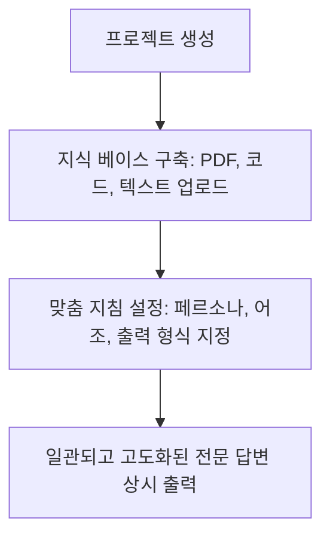

# Claude 3.5 Sonnet 활용법 완벽 분석 및 총정리


# 챗GPT 비켜! 현업 블로거가 밤새며 깨달은 Claude 3.5 Sonnet 활용법 끝판왕 가이드 (실전 프롬프트 포함)

요즘 인공지능 업계는 정말 하루가 다르게 변하고 있습니다. 자고 일어나면 새로운 모델이 나오고, 기존에 쓰던 도구보다 더 뛰어난 성능을 자랑하는 서비스가 쏟아지니까요. 저 역시 수년 동안 다양한 인공지능 도구들을 유료로 결제해가며 사용해 온 헤비 유저 중 한 명입니다. 처음에는 많은 분들처럼 챗GPT(ChatGPT)에 푹 빠져 살았습니다. 하지만 최근 들어 제 작업 흐름을 완전히 뒤흔들어 놓은 녀석이 나타났는데요, 바로 앤트로픽(Anthropic)사에서 출시한 **Claude 3.5 Sonnet**입니다.

며칠 전, 급하게 고객용 웹 대시보드 시안을 만들어야 하는 일이 있었습니다. 평소 같았으면 코드를 짜고, 오류를 수정하고, 화면을 확인하는 데에만 꼬박 밤을 새웠을 텐데, 이번에는 이 모델을 활용해 단 30분 만에 기획부터 동작하는 프로토타입 개발까지 끝내버렸습니다. 진짜 온몸에 소름이 돋더라고요. 

이 놀라운 경험을 저만 알고 있을 수 없어서, 오늘은 제가 직접 맨땅에 헤딩하며 터득한 **Claude 3.5 Sonnet 활용법**의 모든 것을 아주 생생하고 상세하게 공유해 드리려고 합니다. 단순한 기능 소개를 넘어, 실무에서 바로 써먹을 수 있는 구체적인 프롬프트 작성 공식과 꿀팁들까지 가득 담았으니 끝까지 집중해 주세요!

---

## 화면 우측에 마법이 펼쳐진다: 아티팩트(Artifacts) 기능으로 생산성 극대화하기

제가 생각하는 이 모델의 가장 혁신적인 변화는 바로 **아티팩트(Artifacts)** 기능입니다. 기존의 인공지능 모델들은 질문을 하면 채팅창 안에서 텍스트나 코드를 길게 출력해 주는 것이 전부였습니다. 코드가 길어지면 위아래로 스크롤을 하느라 정신이 없고, 복사해서 다른 곳에 붙여넣어 실행해 보기 전까지는 결과물이 어떻게 생겼는지 눈으로 확인하기가 참 번거로웠죠.

하지만 아티팩트 기능은 완전히 다릅니다. 우리가 코드나 웹페이지, 인포그래픽 제작을 요청하면, 채팅창 오른쪽에 독립된 전용 화면이 스르륵 열리면서 결과물을 실시간으로 렌더링해서 보여줍니다. 

> **쉽게 말해, 우리가 요청한 결과물(웹페이지, 게임, 차트 등)이 실제로 어떻게 작동하는지 그 자리에서 바로 확인하고 조작할 수 있는 전용 캔버스가 제공되는 셈입니다.**

### 아티팩트 기능을 제대로 깨우는 실전 프롬프트 작성법

이 기능을 제대로 쓰기 위해서는 단순히 "웹사이트 하나 만들어줘"라고 말하기보다, 아티팩트 창이 열릴 수 있도록 명확한 목적과 환경을 지정해 주는 것이 좋습니다. 제가 자주 쓰는 마법의 프롬프트를 하나 소개해 드릴게요.

```text
[역할 정의]
너는 세계 최고의 사용자 경험(UX) 디자이너이자 프론트엔드 개발자야.

[요청 사항]
개인 자산 관리를 위한 직관적인 대시보드 웹 페이지를 한 페이지짜리 HTML로 작성해 줘.
- 수입과 지출을 입력하면 실시간으로 차트가 반영되어야 해.
- 화면 우측에서 사용자가 직접 데이터를 입력하고 삭제할 수 있는 인터랙티브한 기능이 포함되어야 해.
- 디자인은 최신 유행하는 다크 모드 스타일로, 아주 깔끔하고 세련되게 만들어 줘.

[출력 형식]
반드시 아티팩트(Artifacts) 기능을 활성화하여 우측 화면에서 내가 직접 마우스로 클릭하며 테스트해 볼 수 있도록 완성된 단일 파일 코드로 작성해 줘.
```

이렇게 요청하면, 오른쪽 화면에 아주 세련된 다크 모드 자산 관리 대시보드가 나타납니다. 단순히 눈으로 보는 것뿐만 아니라, 실제로 숫자를 입력하면 그래프가 실시간으로 춤을 추듯 변하는 모습을 확인할 수 있습니다. 코딩을 전혀 모르는 기획자나 마케터라도 이 **Claude 3.5 Sonnet 활용법** 하나만 제대로 익혀두면, 아이디어를 그 자리에서 시각화하여 동료들에게 보여줄 수 있게 되는 것이죠.

---

## 개발알못도 5분 만에 웹 앱을 만드는 기적: 실전 코딩에서의 Claude 3.5 Sonnet 활용법

많은 개발자분들이나 코딩을 공부하시는 분들이 챗GPT에서 이 모델로 대거 이주하고 있는 가장 큰 이유가 무엇일까요? 바로 압도적인 코드 이해도와 논리적 완결성 때문입니다. 

기존 모델들은 코드가 조금만 길어지면 중간에 생략해 버리거나(`// 여기에 기존 코드를 넣으세요` 같은 식으로 얼버무리는 현상), 앞서 작성한 변수명을 까먹고 엉뚱한 변수를 사용해 치명적인 오류를 내뿜곤 했습니다. 하지만 이 모델은 전체적인 코드의 맥락을 아주 끈질기게 붙잡고 갑니다.

### 직접 겪은 코딩 디버깅 경험담

얼마 전, 리액트(React) 기반의 프로젝트를 진행하다가 원인 모를 상태 관리 오류 때문에 서너 시간을 허비한 적이 있습니다. 스택오버플로우를 뒤지고 구글링을 해봐도 답이 안 나오더군요. 밑져야 본전이라는 생각으로 에러 로그와 관련 코드 파일 3개를 통째로 드래그 앤 드롭으로 업로드한 뒤 질문을 던졌습니다.

이때 적용한 저만의 **Claude 3.5 Sonnet 활용법** 디버깅 프롬프트는 다음과 같았습니다.

```text
내가 지금 리액트 앱을 구동하던 중 아래와 같은 에러 메시지를 만났어.
관련된 상태 관리 코드와 컴포넌트 코드를 첨부할게.

[에러 메시지]
(여기에 터미널 에러 로그 복사 붙여넣기)

[분석 요청 사항]
1. 이 에러가 발생한 근본적인 원인을 초보자도 이해할 수 있게 차근차근 설명해 줘.
2. 현재 내 코드 구조에서 어떤 흐름 때문에 이 동기화 문제가 발생했는지 짚어줘.
3. 수정된 전체 코드를 제공하되, 기존 기능이 깨지지 않도록 안전한 리팩토링 방안을 제시해 줘.
```

질문을 올리고 채 10초도 지나지 않아 답변이 나오기 시작했습니다. 놀랍게도 이 모델은 제가 비동기 처리를 하는 과정에서 컴포넌트가 언마운트될 때 메모리 누수가 발생하며 상태가 꼬였다는 점을 정확히 짚어냈습니다. 그러면서 수정안 코드를 완벽하게 작성해 주었는데, 그대로 복사해서 붙여넣으니 거짓말처럼 에러가 사라지고 정상 작동하더라고요. 

개발자분들이라면 아실 겁니다. 에러의 원인을 정확히 짚어내고 가이드라인을 주는 동료 개발자가 옆에 있다는 것이 얼마나 든든한 일인지를요. 이 모델은 바로 그 최고의 동료 역할을 톡톡히 해냅니다.

---

## 인간보다 더 인간다운 글쓰기: 블로그와 기획서 작성을 위한 Claude 3.5 Sonnet 활용법

인공지능으로 글을 쓰다 보면 가장 큰 걸림돌이 있습니다. 바로 특유의 "기계 냄새" 혹은 "인공지능스러운 말투"입니다. 

* "첫째, 둘째, 셋째..."로 시작하는 지나치게 정형화된 나열식 구조
* "요약하자면", "결론적으로", "따라서"의 과도한 남발
* 지나치게 공손하지만 알맹이가 없이 뜬구름 잡는 백과사전식 설명

이런 글들은 독자들에게 지루함을 줄 뿐만 아니라, 구글 검색 엔진에서도 '저품질 콘텐츠'로 분류되어 검색 상위 노출에 불리하게 작용합니다. 하지만 이 모델은 자연스러운 문맥 파악 능력이 매우 뛰어나서, 프롬프트만 제대로 구성해 주면 정말 사람이 직접 겪고 쓴 것 같은 생생하고 감성적인 글을 뽑아낼 수 있습니다.

### 인공지능 냄새를 싹 빼는 자연스러운 글쓰기 프롬프트 설정

제가 블로그 포스팅이나 정보성 글을 작성할 때 애용하는 **Claude 3.5 Sonnet 활용법** 글쓰기 템플릿을 공개합니다. 핵심은 인공지능에게 '인격'과 '제약 조건'을 명확히 부여하는 것입니다.

```text
[배경 설정 및 페르소나]
너는 10년 차 IT 전문 블로거이자, 복잡한 기술을 대중의 눈높이에 맞춰 쉽고 재미있게 설명하는 베테랑 작가야. 독자들과 친근하게 소통하는 다정한 어조를 사용해 줘.

[작성 주제]
초보자를 위한 스마트폰 사진 잘 찍는 방법 5가지

[절대 준수 규칙]
1. "첫째", "둘째" 같은 기계적인 숫자로 문단을 시작하지 마. 대신 자연스러운 흐름으로 화제를 전환해 줘 (예: "가장 먼저 신경 써야 할 부분은 바로...", "그 다음으로 우리가 쉽게 놓치는 것이 있습니다" 등).
2. "요약하자면", "결론적으로" 같은 인공지능 특유의 상투적인 연결어는 절대 쓰지 마.
3. 문장 길이를 다양하게 섞어줘. 아주 짧고 강렬한 문장과 부드럽게 이어지는 긴 문장을 조화롭게 배치해서 가독성을 높여줘.
4. 마치 친구에게 카페에서 수다를 떨며 꿀팁을 전수해 주는 듯한 느낌으로 "~하더라고요", "~인 것 같습니다", "~라는 생각이 듭니다"와 같은 자연스러운 구어체 종결어미를 사용해 줘.
```

이렇게 조건을 걸고 글을 생성해 보면, 기존의 다른 모델들이 뱉어내던 뻔하고 딱딱한 글과는 차원이 다른 결과물이 나옵니다. 글의 흐름이 물 흐르듯 자연스럽고, 중간중간 위트 있는 표현까지 섞여 있어서 수정할 부분이 거의 없을 정도입니다. 블로그 콘텐츠 생산성을 10배 이상 끌어올리고 싶다면 이 방식을 꼭 적용해 보세요.

---

## 수백 페이지 보고서도 3초 만에 꿰뚫어 보는 문서 분석 및 데이터 시각화 기법

직장인이나 대학생분들이라면 매일 쏟아지는 방대한 양의 리포트, 논문, 그리고 피디에프(PDF) 파일에 치여 살기 마련입니다. 저 역시 매주 트렌드 분석 보고서 수십 장을 읽어야 해서 늘 시간에 쫓기곤 했는데요, 이 모델을 만나고 나서 문서 분석의 패러다임이 바뀌었습니다.

콘텍스트 윈도우(Context Window)가 매우 크기 때문에 두꺼운 책 한 권 분량의 문서도 한 번에 업로드하여 분석할 수 있습니다. 단순히 텍스트를 요약하는 수준을 넘어, 문서 간의 모순점을 찾아내거나 숨겨진 인사이트를 도출하는 능력이 발군입니다.

### 복잡한 PDF 문서를 시각적으로 요약하는 노하우

예를 들어, 정부에서 발표한 수십 페이지짜리 복잡한 부동산 정책 보도자료나 신기술 동향 보고서가 있다고 해봅시다. 파일 첨부 기능을 통해 업로드한 뒤, 다음과 같이 요청하는 것이 효과적인 **Claude 3.5 Sonnet 활용법**입니다.

```text
내가 업로드한 이 보고서는 이번 분기 시장 전망에 대한 아주 복잡한 내용을 담고 있어.

[요청 사항]
1. 이 문서의 핵심 주제 3가지를 도출하고, 각각의 주제에 대해 실무자가 반드시 알아야 하는 리스크 요인을 명확히 짚어줘.
2. 텍스트로만 설명하지 말고, 이 보고서의 핵심 수치 데이터를 바탕으로 아티팩트(Artifacts) 기능을 활용해 직관적인 '인포그래픽 대시보드'나 '비교 차트'를 시각적으로 구현해 줘.
```

이렇게 하면 문서를 꼼꼼히 읽지 않고도, 우측 아티팩트 화면에 렌더링된 깔끔한 차트와 요약 그래픽을 보며 문서 전체의 맥락을 한눈에 파악할 수 있습니다. 회의 준비를 하거나 보고서를 작성할 때 이보다 더 강력한 무기는 없을 것입니다.

---

## 나만의 맞춤형 AI 비서 만들기: 프로젝트(Projects) 기능을 통한 고도화된 Claude 3.5 Sonnet 활용법

유료 버전(Pro 멤버십)을 사용하시는 분들이라면 절대 놓쳐서는 안 되는 숨겨진 꿀기능이 있습니다. 바로 **프로젝트(Projects)** 기능입니다. 

우리가 인공지능과 대화를 나눌 때 매번 똑같은 배경지식, 회사 규정, 개인적인 취향, 혹은 자주 쓰는 코드 스타일을 새로 입력해 주어야 해서 번거로웠던 경험이 있으실 겁니다. 프로젝트 기능은 특정 주제나 목적에 맞는 전용 작업 공간을 만들고, 거기에 참고 자료(지식 베이스)와 지침(Instructions)을 미리 저장해 둘 수 있는 기능입니다.



### 프로젝트 기능 세팅 및 실전 적용 예시

예를 들어, 내가 운영하는 쇼핑몰의 고객 응대(CS)를 위한 프로젝트를 만든다고 가정해 보겠습니다.

1. **프로젝트 생성**: '쇼핑몰 고객 응대 비서'라는 이름으로 프로젝트를 만듭니다.
2. **지식 베이스(Knowledge Base) 업로드**: 쇼핑몰의 환불 규정, 배송 안내, 자주 묻는 질문(FAQ) 리스트, 상품 상세 설명서 등을 텍스트나 PDF 파일로 업로드합니다.
3. **사용자 지정 지침(Custom Instructions) 입력**: 
   > "너는 우리 쇼핑몰의 친절하고 전문적인 상담원이야. 항상 고객의 마음에 공감하며 정중한 존댓말을 써야 해. 답변 끝에는 항상 '추가로 궁금하신 점이 있다면 언제든 편하게 말씀해 주세요!'라는 문구를 붙여줘."

이렇게 세팅을 끝내두면, 새로운 대화방을 열 때마다 구구절절 설명할 필요가 전혀 없습니다. 그냥 "어제 주문한 상품에 하자가 있어서 환불하고 싶다는 고객 문의가 들어왔어. 어떻게 답변해야 할까?"라고만 물어봐도, 프로젝트에 저장된 환불 규정을 정확히 참조하여 완벽한 고객 응대 메일 초안을 작성해 줍니다. 

이 **Claude 3.5 Sonnet 활용법**은 1인 기업가나 마케터, 개발자분들의 단순 반복 업무 시간을 획기적으로 줄여줄 수 있는 엄청난 무기입니다.

---

## 솔직히 말씀드리면 단점도 있습니다: 사용 제한과 환각 현상을 극복하는 현실적인 대안

지금까지 침이 마르도록 칭찬만 늘어놓았지만, 세상에 완벽한 도구는 없는 법이죠. 제가 이 모델을 매일 사용하면서 느낀 솔직한 한계점과 이를 현명하게 극복하는 현실적인 노하우를 말씀드리겠습니다.

### 1. 뼈아픈 질문 횟수 제한 (Usage Limits)
무료 사용자는 물론이고, 월 20달러를 내는 유료 구독자라 할지라도 사용량이 몰리는 시간대나 긴 문서를 업로드해 대화를 나누다 보면 금방 "몇 시간 뒤에 다시 시도해 주세요"라는 제한 메시지를 만나게 됩니다. 특히 아티팩트 기능을 켜놓고 코드를 여러 번 수정 요청하면 제한이 생각보다 훨씬 빨리 찾아옵니다.

* **극복 꿀팁**: 질문을 던지기 전에 메모장에 질문할 내용을 미리 정리하고 다듬으세요. 한 번 질문할 때 원하는 조건(역할, 제약 사항, 출력 형식 등)을 정교하게 담아 **단 한 번의 질문으로 고품질의 답변을 얻어내는 '원샷 프롬프팅'**을 습관화해야 질문 횟수를 아낄 수 있습니다.

### 2. 최신 정보의 공백과 환각 현상 (Hallucination)
아무리 똑똑한 인공지능이라도 학습 데이터의 컷오프 시점 이후의 정보나, 아주 지엽적인 인물 정보 등에 대해서는 그럴싸한 거짓말(환각 현상)을 지어내곤 합니다. 특히 실시간 검색 기능이 챗GPT에 비해 다소 아쉬운 편입니다.

* **극복 꿀팁**: 팩트 체크가 생명인 글을 쓰거나 최신 정보를 다룰 때는, 구글 검색을 통해 신뢰할 수 있는 최신 뉴스 기사나 공식 문서의 텍스트를 직접 긁어서 대화창에 제공해 주세요. "내가 제공한 아래의 실시간 정보를 바탕으로 글을 작성해 줘"라고 요청하면 환각 현상을 거의 완벽하게 예방할 수 있습니다.

---

## 자주 묻는 질문들 (FAQ)

독자분들이 제 블로그나 커뮤니티에서 **Claude 3.5 Sonnet 활용법**과 관련해 가장 자주 물어보셨던 질문들을 모아 시원하게 답변해 드리겠습니다.

### Q1. 챗GPT 플러스(유료)와 비교했을 때 어떤 것을 결제하는 것이 더 나은가요?
**A1.** 본인의 주 작업이 무엇이냐에 따라 다릅니다. 만약 **코딩, 웹 프로토타입 제작, 논리적인 글쓰기, 긴 문서 분석**이 주 목적이라면 단연코 이 모델을 추천합니다. 아티팩트 기능과 압도적인 자연어 처리 능력 덕분에 작업 속도가 비교가 안 될 정도로 빠릅니다. 반면, 이미지 생성(DALL-E 3)이 필수적이거나, 실시간 웹 검색을 통한 최신 정보 탐색, 그리고 다양한 맞춤형 지피티스(GPTs) 생태계를 활용하고 싶다면 챗GPT 플러스가 더 유리할 수 있습니다.

### Q2. 아티팩트(Artifacts) 기능이 화면에 보이지 않는데 어떻게 켜나요?
**A2.** 간혹 설정이 꺼져 있어서 보이지 않는 경우가 있습니다. 화면 좌측 하단에 있는 본인의 프로필 아이콘을 클릭한 뒤, **'Feature Preview'** 메뉴로 들어갑니다. 거기서 'Artifacts' 항목을 활성화(On) 상태로 변경해 주시면 바로 사용하실 수 있습니다.

### Q3. 한글로 질문하면 답변 속도가 느리거나 퀄리티가 떨어지지는 않나요?
**A3.** 과거 모델들에 비해 한국어 처리 능력이 비약적으로 상승했습니다. 번역기 특유의 어색함 없이 매우 매끄러운 한국어를 구사합니다. 다만, 코딩이나 매우 전문적인 기술 문서를 분석할 때는 영어로 질문하고 답변을 받은 뒤 한글로 번역해 달라고 요청하는 것이 정보의 손실을 줄이고 답변 속도를 높이는 데 도움이 될 수 있습니다. 하지만 일상적인 업무나 글쓰기 단계에서의 한국어 질문은 한글로 직접 하셔도 충분히 훌륭한 결과물을 보여줍니다.

### Q4. API를 활용해서 나만의 서비스를 만들 때도 유용한가요?
**A4.** 네, 정말 유용합니다. 특히 개발자용 콘솔을 통해 에이피아이(API)를 호출할 때, 응답 속도와 비용 대비 성능(가성비) 면에서 매우 뛰어난 효율을 보여줍니다. 구조화된 데이터(JSON 형식 등)를 출력해 주는 능력이 탁월하기 때문에, 기존 시스템에 인공지능 기능을 접목하고자 하는 기업 고객들에게도 훌륭한 선택지입니다.

### Q5. 이 모델로 작성한 블로그 글이 구글에서 저품질 필터에 걸리지는 않을까요?
**A5.** 단순히 인공지능이 주는 답변을 복사해서 그대로 붙여넣으면 저품질 필터나 유사 문서 판정에 걸릴 확률이 높습니다. 앞서 제가 소개해 드린 **Claude 3.5 Sonnet 활용법** 프롬프트 지침에 따라 본인만의 독창적인 경험담, 구체적인 사례를 섞어서 글을 생성하고, 발행 전에 반드시 본인의 목소리로 어색한 문장을 한 번 더 다듬는 리라이팅 과정을 거치셔야 안전합니다.

---

## 마치며: 인공지능을 내 몸의 일부로 만드는 방법

지금까지 제가 밤새 삽질하며 얻어낸 피와 살 같은 **Claude 3.5 Sonnet 활용법**을 아낌없이 소개해 드렸습니다. 어떠셨나요? 당장 브라우저를 열고 무언가 만들어보고 싶은 욕구가 샘솟지 않으시나요?

인공지능 기술이 아무리 뛰어나도, 그것을 직접 켜서 질문을 던지고 내 업무에 적용해 보지 않으면 그저 남들의 신기한 이야기일 뿐입니다. 처음에는 서툴러도 괜찮습니다. 오늘 제가 알려드린 프롬프트들을 복사해서 아주 사소한 질문부터 시작해 보세요. 

> **"기술은 도구일 뿐이고, 그 도구를 쥐고 세상을 바꾸는 것은 결국 여러분의 상상력입니다."**

오늘 준비한 포스팅이 여러분의 일상과 업무에 작은 혁신의 불씨가 되었기를 바랍니다. 도움이 되셨다면 이 글을 즐겨찾기 해두시고, 작업하시다가 막힐 때마다 꺼내어 참고해 보세요. 앞으로도 더 유익하고 생생한 인공지능 실무 활용 팁으로 찾아뵙겠습니다. 궁금한 점이 있다면 언제든 아래 댓글로 편하게 질문 남겨주세요!